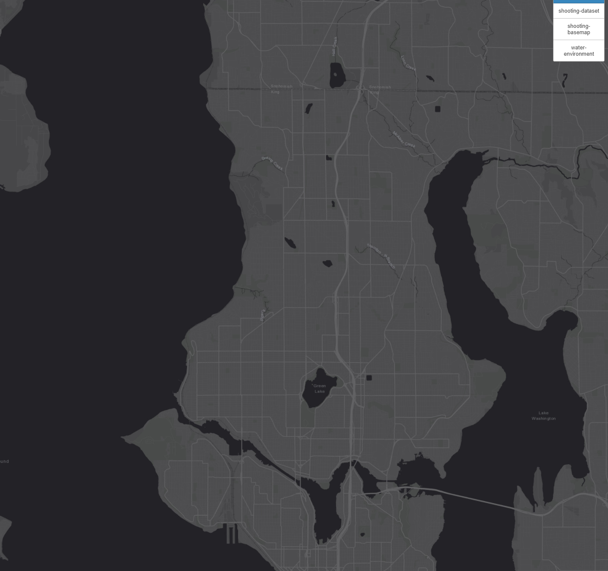
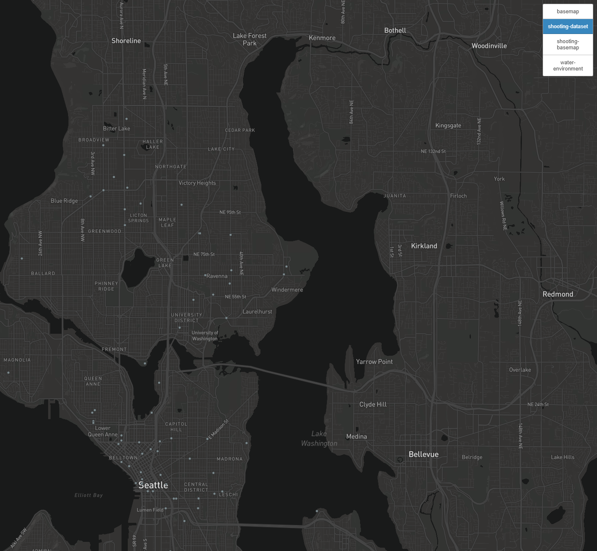
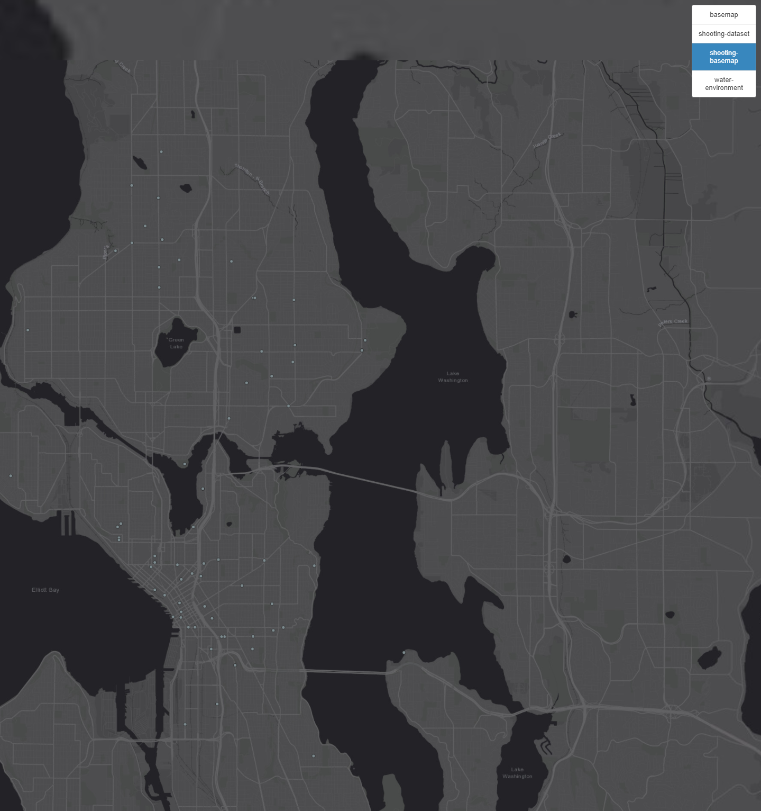
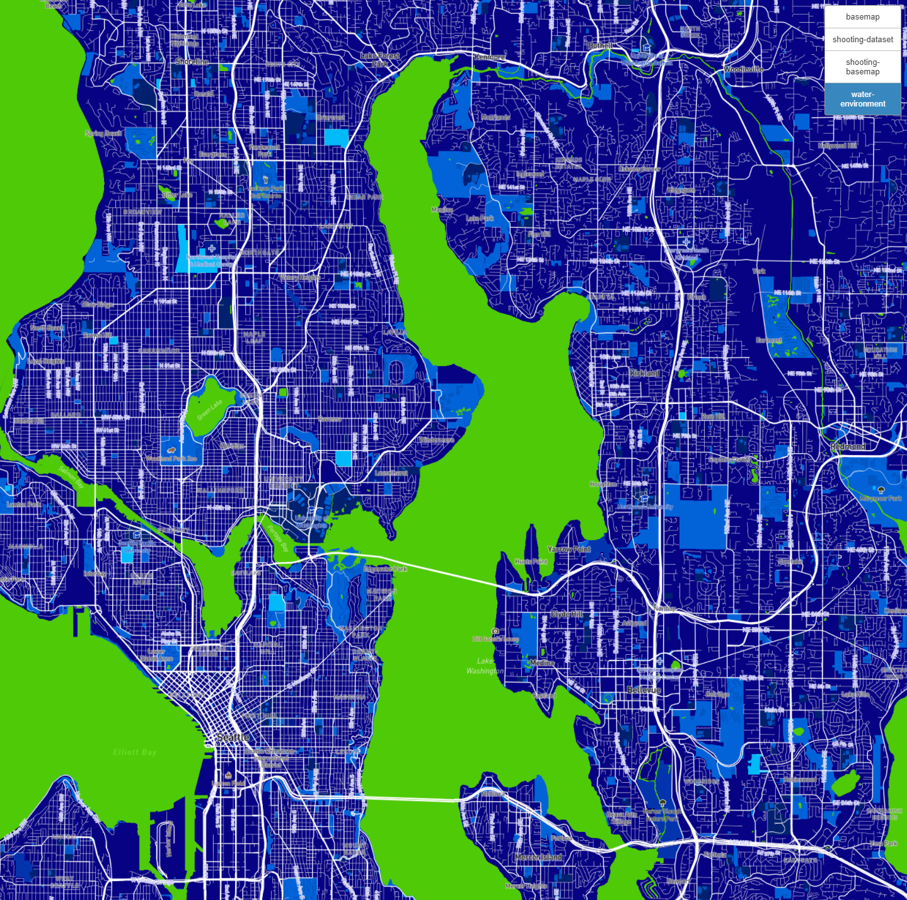

# Seattle-Map-Tiles
## For GEOG 458 Lab 4

# Tile 1 - Basemap

* Used default basemap of a dark colorway from ESRI.

* Zoom Options: Min - 1; Max - 14.

* Area: Seattle, WA.

# Tile 2 - Shooting Dataset

* Data was obtained from the Seattle city website: https://data.seattle.gov/Public-Safety/SPD-Officer-Involved-Shooting-OIS-Data/mg5r-efcm

* Zoom Options: Min - 1; Max - 14.

* Area: Seattle, WA.

# Tile 3 - Basemap and Dataset Combined

* Combined basemap with shooting dataset.

* Zoom Options: Min - 1; Max - 14.

* Area: Seattle, WA.

# Tile 4 - Pastel Environment Theme

* Aggregated the OpenMaps to allow for bodies of water to be much more identifiable, hence the contrasting bright green with blue.

* Zoom Options: Min - 1; Max - 14.

* Area: Seattle, WA.
